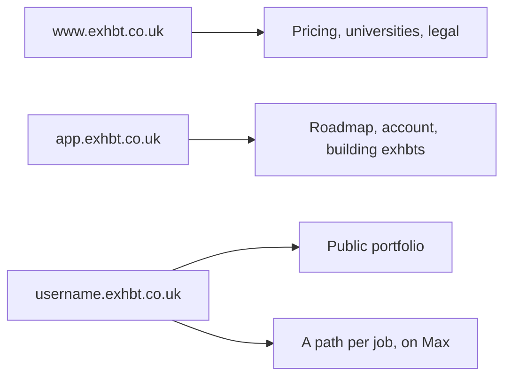

# Exhbt, as it stands

Read this first. Plan figures live only in `lib/entitlements.ts`. Hosts live only in `lib/hosts.ts`. If a sentence elsewhere disagrees with those files, the code is right and the sentence is stale. Decisions, including why the tiers and hosts look like this, are in `docs/decisions/`. How to run the app is `HANDOFF.md`. Visual rules are `DESIGN.md`.

`docs/PLAN.md` is the old plan from when the repo was still called Terna. Do not treat it as current. `design-references/` is other companies' visual notes, not this product.

## Hosts

```mermaid
flowchart LR
  www["www.exhbt.co.uk"] --> marketing["Pricing, universities, legal"]
  app["app.exhbt.co.uk"] --> tool["Roadmap, account, building exhbts"]
  person["username.exhbt.co.uk"] --> portfolio["Public portfolio"]
  person --> job["A path per job, on Max"]
```

The bare apex (exhbt.co.uk) redirects to www with a 308, keeping the path and query, because sign-in cookies are host-only (`canonicalRedirectUrl` in `lib/hosts.ts`, called first in `middleware.ts`). Register the Stripe webhook on www.

**Search engines and link previews.** `lib/seo.ts` is the one table of marketing pages (address, title, description, preview-image words) and builds each page's canonical, Open Graph and Twitter metadata and the JSON-LD (Organization and WebSite in the marketing layout, Person on a portfolio home, CreativeWork on an exhbt). `metadataBase` is set in `app/(marketing)/layout.tsx` only; portfolio pages give absolute addresses on the person's own host (`portfolioCanonical`). Marketing previews are `/og/<page>.png` (`app/(marketing)/og/[key]/route.tsx`, `marketingCard` in `lib/og/card.tsx`); portfolio previews are the `preview.png` routes. Each portfolio host serves its own `/sitemap.xml` and `/robots.txt` (`app/(portfolio)/p/[username]/`; the middleware matcher no longer skips robots.txt). Hidden-from-search portfolios, exhbts left off the home page, job links and owner previews are noindex and out of the sitemap. Rory's Search Console steps are in `LAUNCH.md`.

At launch, with `EXHBT_TOOL_HOST=1` set, www and the apex send /login, /roadmap and /auth to the app host (until then sign-in stays on www, and email links use the request host); a person's host is their portfolio. Localhost and a workers.dev preview stay one origin, so development is unchanged. Employer links are a path on the person's host. Cookies for sign-in stay on the app host. The Worker routes that attach those domains are not in `wrangler.jsonc` yet: a deploy cannot add them until exhbt.co.uk is a zone on this Cloudflare account.

## Plans

Free, Premium and Max differ by how many exhbts someone can keep, whether they get a public portfolio, how many roadmap refreshes and AI drafts they get, file sizes, whether a job gets its own link, and whether publishing runs an originality check. Universities get Max for their students. Employers are free. The stored keys follow the names (`free`, `premium`, `max`, `institutional`; decision 0006). Counts, prices and the checklist sentences come from `ENTITLEMENTS`, `PRICES` and `planFeatures()` in `lib/entitlements.ts`.

On `main` (the live site) the paid plans are still waitlist-only. Payments arrive with Phase 2, below.

## What a person does

Organic visits start on the home page. Ads, social, and QR codes use `/start`. Both ask for the job, then the builder: the CV (skippable), and where you are now with education and skills. The roadmap shows straight away, with no email asked for yet. The order is the `STEPS` array in `app/(app)/roadmap/new/RoadmapWizard.tsx`.

The result is five screens, listed as `VIEWS` in `components/roadmap/RoadmapViews.tsx`: Overview, Gaps, Already strong, Projects, What next. Gaps opens with the one skill radar: the job's levels always, and you, switchable between Now and After the projects (the switch needs the plan's ideas, so it shows after the gate). Projects is behind a gate that asks for a name, an email and optionally LinkedIn, prefilled from the CV. Behind it are three project ideas, each swappable, which become the plan, with a link back to the radar. The ideas are written in the background right after the roadmap, and the page shows progress, or a Try again, until they exist (`docs/decisions/0019-project-ideas-loading.md`). The gate and the plan are in `docs/decisions/0004-email-gate-and-plan.md`. The skill map is in `docs/decisions/0003-cv-step-and-skill-radar.md`; the radar's one-chart design, level anchors and after-projects rule are in `docs/decisions/0023-skill-radar.md` (`lib/roadmap/skills.ts`, `lib/roadmap/radar.ts`).

An exhbt is title, outcome, methodology flow, key-result chart, skill boxes, the work, verification, reflection. The component is `components/exhbt/Exhbt.tsx`. Phase 2 replaces this layout with the block layout below; the demo portfolio, Home and the what-is page already show the new one, and the employer guide (`/how-to-read-an-exhbt`) still shows the old card.

## Phase 2 (on the `phase-2` branch)

Phase 2 is the paid product: build exhbts, publish them to a portfolio, pay for a plan. The plan is `docs/phase-2.md`. It lives on the `phase-2` branch and reaches `main` once, on launch day (`LAUNCH.md`). In production its pages also need the runtime setting `EXHBT_PHASE2=1` (`isPhase2Enabled()` in `lib/site.ts`); in development and tests it's always on.

**Plans and limits.** Every limit is read from `lib/entitlements.ts` and checked on the server: `getPlan()` in `lib/plan.ts` finds the plan (a live subscription, then a university licence, then Free), and `lib/plan-rules.ts` decides (can they start another exhbt, publish one, make a job link). After a downgrade nothing is deleted; the portfolio shows as many published exhbts as the new plan allows, in the person's order.

**The exhbt and its editor.** An exhbt has a fixed core: the header, the title (which is the question the work answers), a context line with its gap highlighted, and the process flowchart (decisions 0007 and 0022). Beside it, a sidebar holds the person, what the work is, where and when, the checks, the work and Save as PDF; the page's look comes from the portfolio's, through the `--xp-*` variables (decision 0022). Below the flowchart come sections the person adds, removes and puts in order: findings, graphs, images, a quote, what I'd do next and a link (decision 0015). The schema, the limits and `wordCount()` are `lib/exhbt/blocks.ts`; the word cap counts everything on the page except image alt text and link addresses (decision 0009). Docs saved before sections are read as sections, in their old order, by `normaliseDoc`, which the store runs on every read. `components/portfolio/ProjectView.tsx` draws it, with What I found beside a neighbouring graph or image. An exhbt also has a layout, `format`: a case study (the default), a gallery for visual work or research for experiments, kept in the same doc and read by `lib/exhbt/formats.ts` (decision 0024). `exhbtSummary()` is the one sentence portfolio cards show (the summary, or the first finding). The editor is `/exhbts/[id]/edit` (`components/editor/`): cards with a small Tiptap field for each text, the flowchart edited on the diagram, sections dragged with dnd-kit or moved with buttons (`Sections.tsx`), live preview, where "Arrange sections" lets them be dragged too (`PreviewArrange.tsx`). Saving never blocks; publishing runs `validateForPublish()` again on the server. `exhbts.blocks` is the working copy and `published_blocks` what employers see, so a live page never shows a half-finished edit.

**Graphs.** Up to two per exhbt, each one of a fixed set of kinds (before and after, bars, grouped and stacked bars, line, scatter, big numbers, a small table), typed in by hand in the graph card, every value printed on the page. The kinds, their caps and checks are `lib/exhbt/charts.ts`; `components/charts/Chart.tsx` draws them for the project page and the editor's preview. A graph can protect its real numbers (shown as a change or an index); publishing then stores only the index, so the typed figures stay in the working copy. Decision 0011.

**Uploads and the AI draft.** `/exhbts/new`. The browser reads most files itself (`lib/doc-readers.ts`); scans and photos go to the AI only with consent (`/api/files/transcribe`). Files go straight from the browser to Supabase Storage with a signed upload URL (`lib/uploads.ts`), into two private buckets: `sources` for project material, `evidence` for images, evidence files and profile photos. Portfolio pages show them through links that expire after an hour (`lib/files.ts`). The draft is `lib/ai/exhbt-draft.ts`, called by `/api/exhbts/draft`; `lib/exhbt/verify.ts` flags any number it can't find in the material. Beside the draft, the pages of a PDF read on the device that draw a chart, diagram or picture go to the AI to pick the figure that best shows the result; it is cut out in the browser and placed beside What I found, and publishing waits until the person ticks that they may share it. They can crop it again, choose another page or remove it (decision 0017).

**Portfolio pages.** The route group `app/(portfolio)`. The home page is Rory's layout (`docs/design/portfolio-and-exhbt-layouts.pdf`, page 1; `components/portfolio/PortfolioHome.tsx`): a top bar and hero (photo, "Hi, I'm", the name, the intro), then sections the person adds and drags into order: their best piece of work in a band, more of their work as cards, About me with education and tools, experience, a quote, Get in touch. Every colour and corner is a CSS variable set by the look (decision 0016). The tab shows their name first and their initials as its icon (`initials.svg`). An owner with nothing live sees a preview at their own address; visitors get not found. A project page sits in the frame of `p/[username]/[slug]/layout.tsx`. Which host serves what is decision 0001 and `lib/hosts.ts`; the subdomain routing is being built separately.

**Billing.** Stripe Checkout and the Billing Portal from `/account/billing`; `lib/stripe.ts`; the webhook at `/api/stripe/webhook` writes `subscriptions`. `/api/health` reports the Stripe settings and the Storage buckets under `phase2`, without affecting `ok`.

**Per-job links (Max).** `/job-links` makes them (`docs/phase-2.md` section 8, decision 0008): paste a job description or a link, the AI picks the best exhbts with a reason each, the person reorders, swaps, chooses the address and can switch it off. The public page is connected: `p/[username]/[slug]/page.tsx` checks for a job link first (`jobLinkFor` in `lib/job-link-request.ts`, which counts the view once per request), so `amara.exhbt.co.uk/lloyds` shows `components/portfolio/JobLinkView.tsx`: the person, "For <Company> · <Role>", their intro, and the picked exhbts as the portfolio home's own cards (`ProjectCard`) with the reason under each, in the person's look. The project frame (`[slug]/layout.tsx`) steps aside for it. A link that is off, deleted, on a plan without job links, or with none of its exhbts live is not found; the page is never indexed. A project opened with `?for=<slug>` shows "Back to <company>" while that link is live and picks it (`jobLinkBackTarget`). An exhbt and a job link share one slug space per person (`lib/slugs.ts`), so they cannot collide. The owner's preview is `/job-links/[id]/preview`. `JOB_LINKS_LIVE` in `lib/entitlements.ts` switches the "coming soon" wording off.

**Roadmaps list and saved ideas.** `/roadmap` lists the person's roadmaps (`listRoadmapsFor`) and starts a new one for a different job from just the job, reusing the newest roadmap's details (`startRoadmapForJob` in `app/(app)/roadmap/actions.ts`, sharing `createRoadmapFor` in `lib/roadmap-create.ts` with the builder). Premium and Max can save a project idea to a list kept across roadmaps (`savedIdeas` in `lib/entitlements.ts`, page `/roadmap/saved`, table `saved_ideas`); a saved idea is a copy, so a swap never changes it. Decision 0010.

**Portfolio looks.** Eight looks from Rory's spec (Exhbt, Classic professional, Notebook, Mono, Night, Studio, Ledger, Bloom; some with colourways) in `lib/portfolio-themes.ts`. A look sets the colours, faces, corners, graph shades and layout treatments of the whole portfolio: the home page, every exhbt page, the pager, the sign-off and per-job pages, through one set of `--pf-*` variables (`themeStyle` in `components/portfolio/themeFonts.ts`; the exhbt page's `--xp-*` names read it). `portfolioThemes` in `lib/entitlements.ts` says how many of them a plan has; `themeFor(profile, plan)` picks the one to show and falls back to the default after a downgrade without clearing the saved choice; ids saved before the eight map to the nearest (`LEGACY_IDS`). The picker is the builder's "Your look" step; the id is stored in `profiles.portfolio_theme`. Decision 0018.

**Portfolio builder.** `/portfolio` is one guided flow in four steps (You, Your look, Your projects, Publish) with a live preview of the whole page and autosave with an undo (`app/(app)/portfolio/`, decision 0016). The You step holds the profile fields (`lib/portfolio-profile.ts`) and "Suggest an intro" (`lib/ai/portfolio-intro.ts`, facts the person gave only). The Your page step orders, stars and hides the exhbts and adds the home page's sections and their words; the sections are dragged into order in the live preview (experience and a quote need `extraTiles` in `lib/entitlements.ts`). Publish holds the address, which only paid plans can claim (`canClaimUsername` in `lib/plan-rules.ts`). `/account/portfolio` and `/portfolio/customise` redirect into it. The layout is `profiles.portfolio_layout` (`lib/portfolio-layout.ts`); hidden and featured are `exhbts.hidden_on_portfolio` and `profiles.featured_exhbt_id`; project order stays `exhbts.position`. A hidden exhbt keeps its own link. Decision 0014.

**Teammates and identical files.** An exhbt's owner invites teammates by email from `/exhbts/[id]/team`; accepted ones show under the author on the project page and on the tile, and can make their own exhbt from the project with their own copies of its files (`team_of`). After every upload the server fingerprints the stored file (`/api/files/[id]/complete`); the same file on someone else's exhbt gets a private "Were you on that project together?" and never a public label. `lib/team.ts`, `lib/duplicates.ts`, decision 0013.

**Privacy.** The account export (`/api/account/export`, `exportUserData` in `lib/store.ts`) includes the portfolio profile, every exhbt with both copies, file details (not the files), subscriptions, saved ideas, team memberships and invites, and the person's own side of any file match. The privacy policy and terms are `app/(marketing)/legal/[doc]/page.tsx`.

**The lab.** `/lab/editor` is a try-out page, not part of the product: a prototype of editing an exhbt on the page itself, with two versions of drag and drop, on sample exhbts held in memory (`app/lab/editor/`, `components/lab/`). No sign-in, nothing stored, never indexed. It is on in development, in tests and on the preview site (`EXHBT_LAB=1` in the preview Worker's vars only) and not found on the live site (`isLabEnabled()` in `lib/site.ts`). What it found is `docs/briefs/edit-on-page/drag-prototype.md`.

## Where to change something

| You want to change | Open |
|---|---|
| A plan's limits or its checklist | `lib/entitlements.ts`, then a new file in `docs/decisions/` if the decision changed |
| A hostname or the shape of a portfolio address | `lib/hosts.ts` |
| Copy on the pricing page | It reads `planFeatures()` and `PLAN_NAMES`. Don't type the figures again |
| How Phase 1 runs | `HANDOFF.md` |
| Colours, type, the exhbt's layout rules | `DESIGN.md` |
| A plan's price, or which plan unlocks what | `lib/entitlements.ts`; the rules that read it are `lib/plan-rules.ts` |
| The exhbt's blocks, limits or word cap | `lib/exhbt/blocks.ts`, and decisions 0007, 0009 and 0015 |
| Which sections an exhbt can have below the flowchart, and how they're added, moved and drawn | `lib/exhbt/blocks.ts` (`SectionSchema`, `normaliseDoc`), `lib/exhbt/sections.ts`, `components/editor/Sections.tsx`, `components/portfolio/ProjectView.tsx`, decision 0015 |
| A kind of graph, its caps, how it's drawn, or protected numbers | `lib/exhbt/charts.ts`, `components/charts/`, the graph card `components/editor/ChartEditor.tsx`, decision 0011 |
| An exhbt's layout (case study, gallery, research) | `lib/exhbt/formats.ts`, `components/portfolio/formats/`, `components/editor/LayoutPicker.tsx`, decision 0024 |
| How an exhbt looks on a portfolio: the sidebar, the title as the question, findings beside the chart, print | `components/portfolio/ProjectView.tsx`, decision 0022 |
| How a portfolio look restyles the exhbt page | the look's `--pf-*` set (decision 0018), read as the `--xp-*` names in `app/globals.css` (`[data-look]`, listed in decision 0022); the frame `app/(portfolio)/p/[username]/[slug]/layout.tsx` |
| The editor | `app/(app)/exhbts/[id]/edit/`, `components/editor/` |
| The AI draft prompt, or the number check | `lib/ai/exhbt-draft.ts`, `lib/exhbt/verify.ts` |
| The figure picked from an upload: which pages are sent, the pick prompt, the cut-out, the share tick, cropping and swapping pages | `lib/figures/`, `lib/ai/figure-pick.ts`, `/api/exhbts/figure-pick`, `/api/exhbts/[id]/figure`, `app/(app)/exhbts/new/figure.ts`, `components/editor/PickedFigure.tsx`, decision 0017 |
| File types, size checks, buckets | `lib/uploads.ts`, `lib/files.ts` |
| Stripe checkout, portal, webhook | `app/(app)/account/billing/`, `lib/stripe.ts`, `app/api/stripe/webhook/route.ts` |
| How project ideas are started, shown while pending, retried; the stand-in's `EXHBT_MOCK_IDEAS_DELAY_MS` and `EXHBT_MOCK_IDEAS_FAIL_FIRST` | `lib/roadmap/ideas.ts`, `lib/ai/projects.ts`, `components/roadmap/IdeasPending.tsx`, decision 0019 |
| Roadmaps list, saved ideas | `app/(app)/roadmap/page.tsx`, `app/(app)/roadmap/saved/`, `components/roadmap/SaveIdea.tsx`, decision 0010 |
| Portfolio looks: colours, fonts, treatments, graph shades, old ids, which plan has which | `lib/portfolio-themes.ts`, `components/portfolio/themeFonts.ts` (variables and font loading), `portfolioThemes` in `lib/entitlements.ts`, decision 0018 |
| Teammates, invites, a teammate's own exhbt, matching identical files | `lib/team.ts`, `lib/team-rules.ts`, `lib/duplicates.ts`, `app/(app)/exhbts/[id]/team/`, decision 0013 |
| The portfolio builder, the layout schema, extra tiles | `app/(app)/portfolio/`, `lib/portfolio-layout.ts`, `components/portfolio/ExtraTiles.tsx`, decisions 0014 and 0016 |
| The portfolio home, its sections and what a card shows, the look's page variables, the profile fields, "Suggest an intro" | `components/portfolio/PortfolioHome.tsx`, `lib/portfolio-home.ts`, `lib/portfolio-layout.ts` (`sectionsOf`), `themeStyle` in `components/portfolio/themeFonts.ts`, `lib/portfolio-profile.ts`, `lib/ai/portfolio-intro.ts`, decisions 0016 and 0018 |
| Referrals (off): the link, cookie, credit, the `REFERRALS_LIVE` switch, the credit figure | `lib/referrals.ts`, `app/r/[code]/route.ts`, `applyReferralsOnCheckout` in `app/api/stripe/webhook/route.ts`, `REFERRAL_CREDIT_PENCE` in `lib/entitlements.ts`, decision 0020 |
| The admin panel (team only, read-only), its role check, and the anonymous page-view beacon | `app/(app)/admin/`, `lib/admin.ts`, `lib/admin-supabase.ts`, the `/* admin */` block in `lib/store.ts`, `app/api/pv/route.ts`, `components/site/PageViewBeacon.tsx`, decision 0021 |
| What the account export includes | `exportUserData` in `lib/store.ts` (both implementations) |
| Privacy policy, terms, cookies | `app/(marketing)/legal/[doc]/page.tsx` |
| A marketing page's title, description or link-preview image, canonical addresses, JSON-LD, sitemaps, robots.txt | `lib/seo.ts`, `lib/og/card.tsx`, `app/(marketing)/og/[key]/route.tsx`, `app/sitemap.ts`, `app/robots.ts`, `app/(portfolio)/p/[username]/sitemap.xml/route.ts` and `robots.txt/route.ts`, `e2e/seo.spec.ts` |
| The editor lab (the edit-on-page drag prototype), its samples and its switch | `app/lab/editor/page.tsx`, `components/lab/`, `isLabEnabled()` in `lib/site.ts`, `docs/briefs/edit-on-page/drag-prototype.md` |
| When a legal page last changed (printed on the page, and the sitemap's lastmod) | `lib/legal.ts` |
